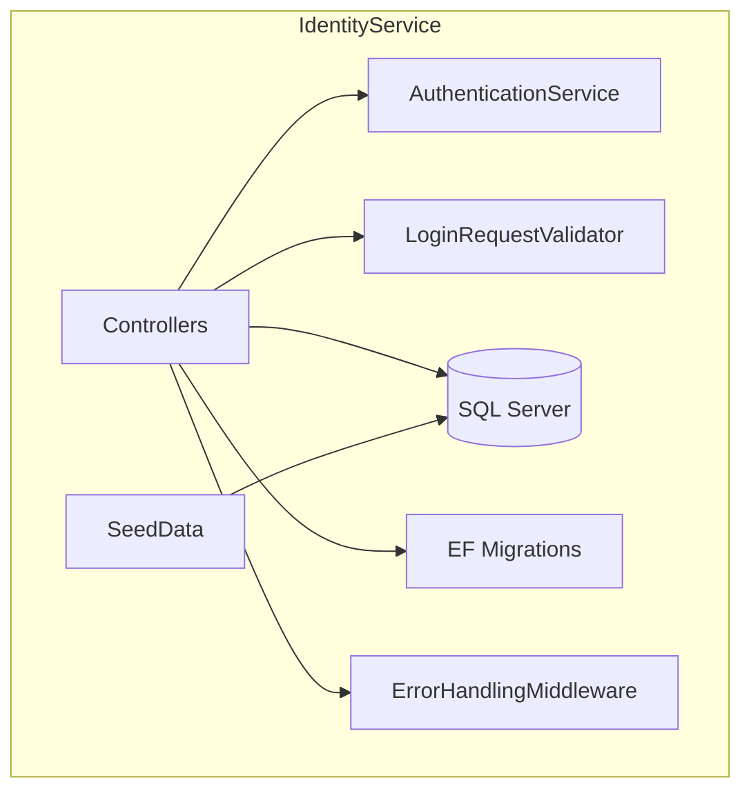

# Identity Service

This project is an Identity Service that provides user authentication and management functionalities. It is designed to handle user-related HTTP requests and manage authentication processes.

## Project Structure

- **Controllers/**: Contains the controllers that handle incoming HTTP requests.
  - `UsersController.cs`: Manages user-related operations.
  - `AuthController.cs`: Handles authentication requests.

- **Data/**: Contains the data access layer components.
  - `ApplicationDbContext.cs`: Represents the database context for the application.
  - `Migrations/`: Holds migration files for database schema changes.
  - `SeedData.cs`: Contains methods for seeding initial data into the database.

- **Models/**: Contains the data models used in the application.
  - `User.cs`: Represents the user entity.

- **Services/**: Contains the business logic services.
  - `AuthenticationService.cs`: Handles authentication logic.

- **Validators/**: Contains classes for validating requests.
  - `LoginRequestValidator.cs`: Validates login requests.

- **Middleware/**: Contains middleware components for the application.
  - `ErrorHandlingMiddleware.cs`: Manages error handling.

- **certs/**: Contains certificate files for secure communication.
  - `servercert.pfx`: Server certificate in PFX format.
  - `servercert.cer`: Server certificate in CER format.
  - `clientcert.pfx`: Simulated client certificate in PFX format (optional).

- **Program.cs**: The entry point of the application.

- **IdentityService.csproj**: Project file containing configurations and dependencies.

- **appsettings.json**: Configuration settings for the application.

- **appsettings.Development.json**: Development-specific configuration settings.

## Getting Started

To get started with the Identity Service, clone the repository and restore the dependencies. You can then run the application and access the API endpoints for user management and authentication.

## Contributing

Contributions are welcome! Please feel free to submit a pull request or open an issue for any enhancements or bug fixes.

